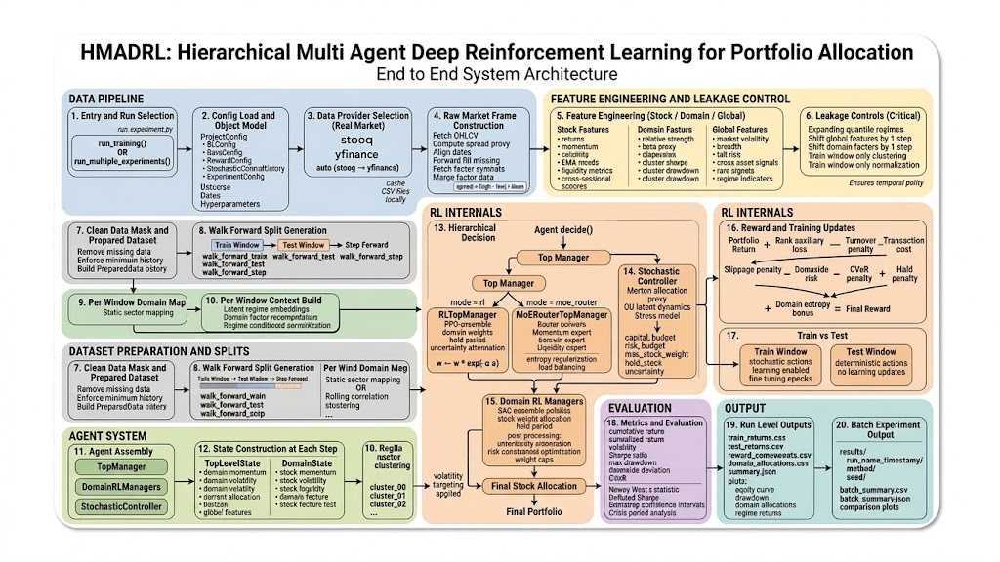

# HMADRL
### Hierarchical Multi-Agent Deep Reinforcement Learning for Portfolio Allocation

> A research-grade hierarchical reinforcement learning framework combining **hierarchical decision-making**, **stochastic control**, **domain specialization**, and **walk-forward evaluation** for robust portfolio strategies on real market data.

---

## Table of Contents

- [Architecture Overview](#architecture-overview)
- [Key Features](#key-features)
- [System Execution Flow](#system-execution-flow)
- [Hierarchical Decision System](#hierarchical-decision-system)
- [Training & Reward System](#training--reward-system)
- [Evaluation](#evaluation)
- [Output Structure](#output-structure)
- [Running Experiments](#running-experiments)

---

## Architecture Overview

HMADRL models portfolio construction as a **multi-level decision hierarchy** that mirrors real institutional portfolio management — separating asset allocation from security selection.



---

## Key Features

### 🧠 Advanced Reinforcement Learning

| Component | Algorithm | Role |
|-----------|-----------|------|
| Top Manager | PPO Ensemble | Domain-level capital allocation |
| Domain Managers | SAC Ensemble | Stock-level security selection |
| Router | MoE Neural Router | Expert selection |

Additional techniques:
- Uncertainty-aware policy aggregation
- Entropy regularization
- Hold-period learning
- Risk-aware reward shaping

---

### 🔀 Mixture-of-Experts Router

An alternative top manager uses **MoE routing** to dynamically select among specialized experts:

```
Momentum Expert  ──┐
Low-Vol Expert   ──┼──▶  Neural Router Policy  ──▶  Allocation
Liquidity Expert ──┘
```

The router is trained with **entropy regularization** and **load balancing penalties** to prevent expert collapse.

---

### 📐 Stochastic Financial Control

The stochastic controller layer integrates classical financial theory with learned dynamics:

| Model | Purpose |
|-------|---------|
| Merton Portfolio Approximation | Optimal allocation proxy |
| Ornstein-Uhlenbeck Latent Dynamics | Mean-reverting state estimation |
| Stress Modeling | Tail-risk scenario conditioning |

**Output control signals:**

```yaml
capital_budget:    # Total capital to deploy
risk_budget:       # Allowable portfolio risk
max_stock_weight:  # Per-asset concentration limit
hold_steps:        # Rebalance frequency control
merton_fraction:   # Risky asset fraction proxy
uncertainty:       # Epistemic uncertainty estimate
```

---

### 🗂️ Domain Specialization

Stocks are grouped into **domains** using one of three methods:

- `static`    → Predefined sector classifications
- `rolling`   → Correlation-based clustering (walk-forward)
- `learned`   → Unsupervised clustering (train-only fit)

Each domain has its own **independent SAC ensemble policy** for stock selection.

---

### 📊 Real Market Data Pipeline

**Data sources:**

```
stooq  ──┐
         ├──▶  auto (stooq → yfinance fallback)  ──▶  data_cache/
yfinance─┘
```

**Feature set:**

| Level | Features |
|-------|----------|
| **Stock** | Momentum, volatility, EMA trends, liquidity, microstructure |
| **Domain** | Relative strength, beta proxy, correlation dispersion, cluster Sharpe, drawdown |
| **Global** | Market volatility, breadth indicators, tail risk, cross-asset signals, rate dynamics, regime indicators |

---

### 🔒 Leakage-Safe Pipeline

Research-grade backtesting integrity is enforced via strict temporal controls:

| Protection | Implementation |
|------------|---------------|
| Regime labels | Expanding quantile (no future data) |
| Macro features | Shifted by one period |
| Domain factors | Shifted by one period |
| Normalization | Fit on train window only |
| Clustering | Fit on train window only |
| Evaluation | Walk-forward out-of-sample |

---

## System Execution Flow

### Entry Point

```python
# Single experiment
run_training(...)

# Batch (multiple seeds + method comparisons)
run_multiple_experiments(...)
```

### Configuration

```
ProjectConfig
├── RLConfig            # Hyperparameters, algorithms
├── DataConfig          # Datasets, date ranges
├── RewardConfig        # Penalties and bonuses
├── StochasticControlConfig
└── ExperimentConfig    # Output paths, seeds
```

### Walk-Forward Windows

```
│◄── Train Window ──►│◄─ Test ─►│
                      │◄── Train Window ──►│◄─ Test ─►│
                                            │◄── Train Window ──►│◄─ Test ─►│
```

Parameters: `walk_forward_train` · `walk_forward_test` · `walk_forward_step`

---

## Hierarchical Decision System

### Top Manager — `RLTopManager`

Uses a **PPO ensemble** to output domain weights and hold periods.

**Uncertainty attenuation:**

$$w \leftarrow w \cdot e^{-\alpha \sigma}$$

Weights are renormalized after adjustment.

---

### Top Manager — `MoERouterTopManager`

Uses expert routing with:
- Entropy regularization
- Load balancing penalties
- Reward-driven router training

---

### Stochastic Controller

Transforms top-level allocations into financial control signals using **OU latent dynamics** and **Merton portfolio theory**.

---

### Domain Managers

Each domain runs an independent **SAC ensemble**. Features include:

- Uncertainty-weighted action aggregation
- Lagrangian risk penalty enforcement
- Per-asset weight caps
- Hold period decisions

---

### Final Portfolio Construction

```
Domain Outputs
     │
     ▼
Weight Normalization
     │
     ▼
Volatility Targeting
     │
     ▼
Risk Scaling
     │
     ▼
Final Stock Weights
```

---

## Training & Reward System

The reward signal is a **composite of multiple financial objectives**:

```
R = portfolio_return
  − rank_consistency_loss
  − turnover_penalty
  − transaction_cost_penalty
  − slippage_penalty
  − downside_risk_penalty
  − CVaR_normalization_term
  − hold_penalty
  + domain_entropy_bonus
```

**Train vs. Test behavior:**

| Mode | Actions | Learning |
|------|---------|----------|
| Train | Stochastic | Enabled, multi-epoch fine-tuning |
| Test | Deterministic | Disabled, pure evaluation |

---

## Evaluation

### Core Metrics

| Metric | Description |
|--------|-------------|
| Cumulative Return | Total compounded return |
| Annualized Return | Annualized performance |
| Volatility | Realized standard deviation |
| Sharpe Ratio | Risk-adjusted return |
| Max Drawdown | Worst peak-to-trough decline |
| Downside Deviation | Downside semi-deviation |
| CVaR | Conditional Value-at-Risk |

### Research Metrics

- Newey-West t-statistic (HAC standard errors)
- Deflated Sharpe Ratio (multiple-testing correction)
- Bootstrap confidence intervals
- Crisis period performance attribution
- Turnover decomposition
- Liquidity capacity analysis

---

## Output Structure

```
results/
└── <run_name>_<timestamp>/
    └── <method>/
        └── seed_<x>/
            ├── train_returns.csv
            ├── test_returns.csv
            ├── losses.csv
            ├── reward_components.csv
            ├── train_domain_allocations.csv
            ├── test_domain_allocations.csv
            ├── walk_forward_windows.csv
            └── summary.json
```

**Batch experiments** additionally produce:

```
results/<run_name>_<timestamp>/
├── batch_summary.csv
├── batch_summary.json
└── comparative_plots/
```

**Visualizations include:** reward curves · equity curves · drawdown charts · domain allocations · regime-conditional returns

---

## Running Experiments

```bash
# Single experiment
python run_experiment.py

# Batch (multiple seeds + method comparisons)
python run_experiment.py --batch
```

---

## Research Applications

HMADRL is designed for academic experimentation in:

- Hierarchical reinforcement learning architectures
- Multi-agent portfolio optimization
- Regime-aware trading strategies
- Financial stochastic control integration
- Mixture-of-experts decision routing
- Reproducible financial RL benchmarks

---

<div align="center">

*Developed as a research framework for hierarchical reinforcement learning in portfolio management.*

</div>
